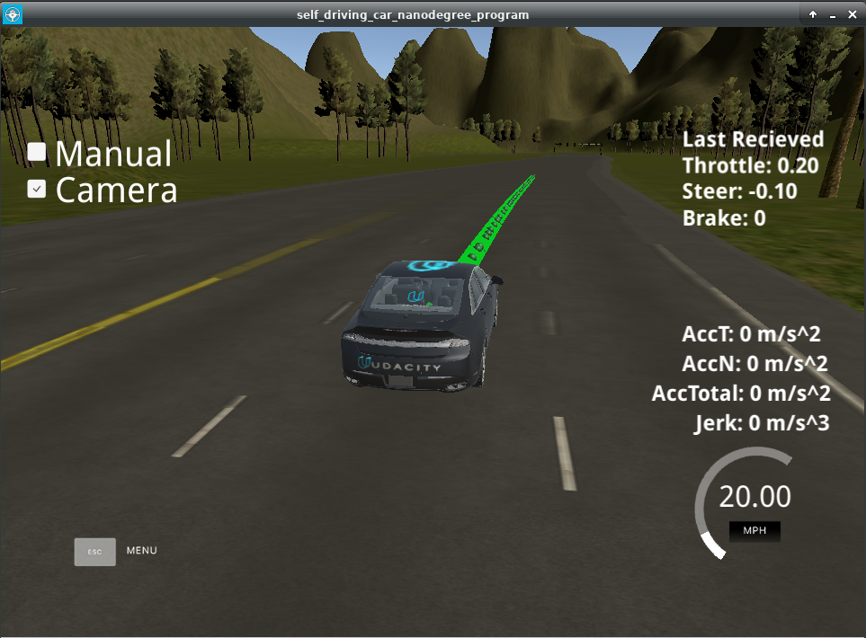
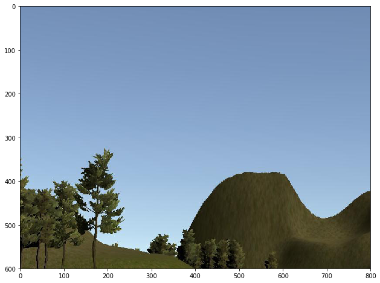
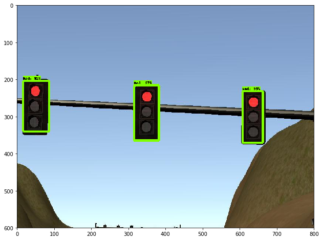
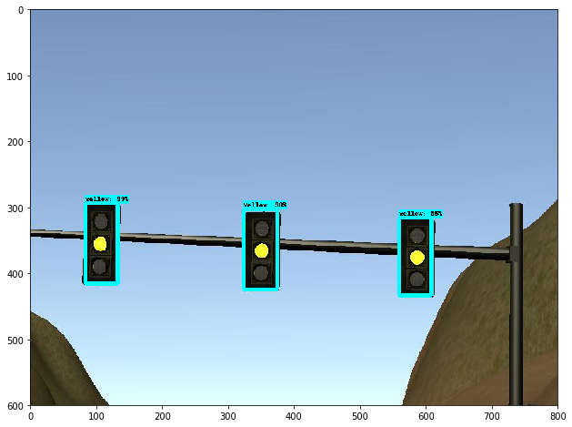
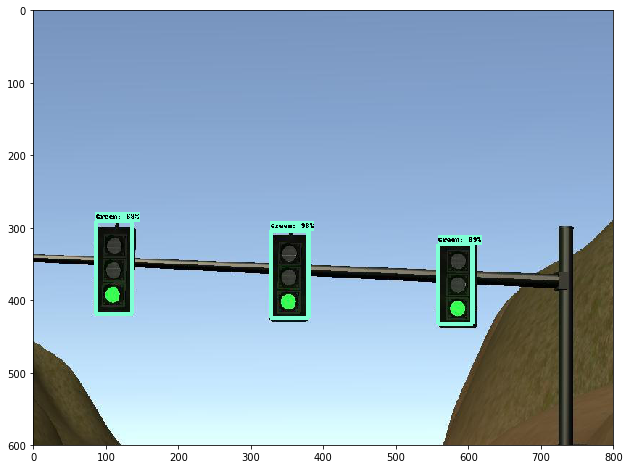

This is the project repo for the final project of the Udacity Self-Driving Car Nanodegree: Programming a Real Self-Driving Car. For more information about the project, see the project introduction [here](https://classroom.udacity.com/nanodegrees/nd013/parts/6047fe34-d93c-4f50-8336-b70ef10cb4b2/modules/e1a23b06-329a-4684-a717-ad476f0d8dff/lessons/462c933d-9f24-42d3-8bdc-a08a5fc866e4/concepts/5ab4b122-83e6-436d-850f-9f4d26627fd9).

# Individual Submission - NO Group Work!

| Name | Udacity Mail Account |
|------|----------------------|
|Heiko Schmidt | udacity@heikoschmidt.info   |



## Project Description

In this project, a ROS environment is used to control a car driving on a multi lane street. The goal is to drive one full lap while passing given waypoints, detecting traffic light states and stop in front of a corresponding stopline to the traffic light.

### Waypoint Updater

The waypoint updater node's task is to publish a fixed number of waypoints in front of the car's current position. The waypoints are provided by data from Udacity at specific points in space and have a target velocity attached. This target velocity must not be higher than the speed limit and needs to be adjusted to make the car come to a stop at a red traffic light's stop line. The movement is controled by the drive-by-wire node.

###  Drive-By-Wire Node

The DBW node represents the car's controller. It's task is to control the throttle, brake and steering and published all as ROS twist commands to the car. It uses the twist controller module.

### Twist Controller

The twist controller is used in the above mentioned DBW node to control acceleration and steering. The module uses controllers (PID for throttle and steering, low pass for speed).

### Traffic Light Detection and Classification

The traffic light detection and classification node is used to identify the nearest traffic light, to check it's state from given camera images and to coordinate where and when to stop and when to start driving again.

For this task I used the [Tensorflow Object Detection API](https://github.com/tensorflow/models/tree/master/research/object_detection). For training, I used a pre-trained Single Shot MultiBox Detector model from [here](https://github.com/mkoehnke/CarND-Capstone-TrafficLightDetection).

Here are some example image from the classification:







### Known Problems and Difficulties during Project Work

* I had massive performance problems when camera is switched on in the simulator, no matter if I used the given VM from Udacity, the docker image, the workspace or even a local installation on a well powered machine with GPU. Even without detection the car isn't able to follow the waypoints due to massive delays. The only way to make it run was a Ubuntu live system on my working PC
* To address the performance issue, the frequency for the waypoint publishing was decreased to 25Hz, and the publishing of obstacle and lidar data as been stubbed
* While waiting at a traffic light the car sometimes is not able to full stop and starts accelerating for a short time, before it's stopping completely. This is currently addressed by stopping four waypoints in front of the stopline waypoint.
* As this is an individual submission and the software is not intended to run on Carla according to Udacity, the net was trained against real world images but never optimized on that and there's no distinction in the software to select different models for real world and simulation.

***Note***
I shrinked down the repository by deleting the classifier training data. This is due to the limitation for the Udacity project submission in repository size. If you need any data or information on that, please feel free to contact me.

# Installation Instructions
Please use **one** of the two installation options, either native **or** docker installation.

### Native Installation

* Be sure that your workstation is running Ubuntu 16.04 Xenial Xerus or Ubuntu 14.04 Trusty Tahir. [Ubuntu downloads can be found here](https://www.ubuntu.com/download/desktop).
* If using a Virtual Machine to install Ubuntu, use the following configuration as minimum:
  * 2 CPU
  * 2 GB system memory
  * 25 GB of free hard drive space

  The Udacity provided virtual machine has ROS and Dataspeed DBW already installed, so you can skip the next two steps if you are using this.

* Follow these instructions to install ROS
  * [ROS Kinetic](http://wiki.ros.org/kinetic/Installation/Ubuntu) if you have Ubuntu 16.04.
  * [ROS Indigo](http://wiki.ros.org/indigo/Installation/Ubuntu) if you have Ubuntu 14.04.
* [Dataspeed DBW](https://bitbucket.org/DataspeedInc/dbw_mkz_ros)
  * Use this option to install the SDK on a workstation that already has ROS installed: [One Line SDK Install (binary)](https://bitbucket.org/DataspeedInc/dbw_mkz_ros/src/81e63fcc335d7b64139d7482017d6a97b405e250/ROS_SETUP.md?fileviewer=file-view-default)
* Download the [Udacity Simulator](https://github.com/udacity/CarND-Capstone/releases).

### Docker Installation
[Install Docker](https://docs.docker.com/engine/installation/)

Build the docker container
```bash
docker build . -t capstone
```

Run the docker file
```bash
docker run -p 4567:4567 -v $PWD:/capstone -v /tmp/log:/root/.ros/ --rm -it capstone
```

### Port Forwarding
To set up port forwarding, please refer to the [instructions from term 2](https://classroom.udacity.com/nanodegrees/nd013/parts/40f38239-66b6-46ec-ae68-03afd8a601c8/modules/0949fca6-b379-42af-a919-ee50aa304e6a/lessons/f758c44c-5e40-4e01-93b5-1a82aa4e044f/concepts/16cf4a78-4fc7-49e1-8621-3450ca938b77)

### Usage

1. Clone the project repository
```bash
git clone https://github.com/udacity/CarND-Capstone.git
```

2. Install python dependencies
```bash
cd CarND-Capstone
pip install -r requirements.txt
```
3. Make and run styx
```bash
cd ros
catkin_make
source devel/setup.sh
roslaunch launch/styx.launch
```
4. Run the simulator

### Real world testing
1. Download [training bag](https://s3-us-west-1.amazonaws.com/udacity-selfdrivingcar/traffic_light_bag_file.zip) that was recorded on the Udacity self-driving car.
2. Unzip the file
```bash
unzip traffic_light_bag_file.zip
```
3. Play the bag file
```bash
rosbag play -l traffic_light_bag_file/traffic_light_training.bag
```
4. Launch your project in site mode
```bash
cd CarND-Capstone/ros
roslaunch launch/site.launch
```
5. Confirm that traffic light detection works on real life images

### Other library/driver information
Outside of `requirements.txt`, here is information on other driver/library versions used in the simulator and Carla:

Specific to these libraries, the simulator grader and Carla use the following:

|        | Simulator | Carla  |
| :-----------: |:-------------:| :-----:|
| Nvidia driver | 384.130 | 384.130 |
| CUDA | 8.0.61 | 8.0.61 |
| cuDNN | 6.0.21 | 6.0.21 |
| TensorRT | N/A | N/A |
| OpenCV | 3.2.0-dev | 2.4.8 |
| OpenMP | N/A | N/A |

We are working on a fix to line up the OpenCV versions between the two.
